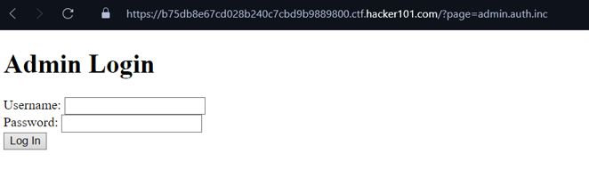
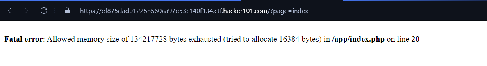
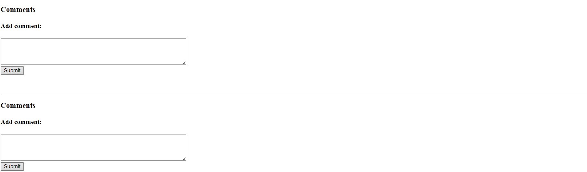
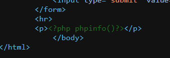
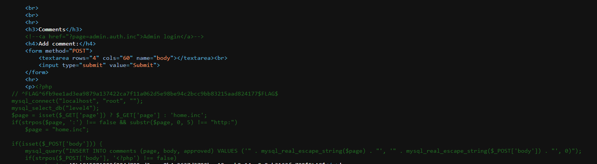
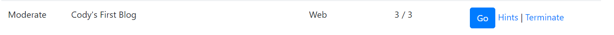

# FIAP - 1° Checkpoint - Pesquisa Vulns Web & Hacker101 CTF

## Introdução
Checkpoint realizado com o intuito de colocar em prática todos os conhecimentos sobre vulnerabilidades web na matéria de Web Exploit, ministrada pelo [Professor Rafael Trassi](https://www.linkedin.com/in/rafael-trassi/).

## Feito por

- Matheus Rosa


## 1ª Parte - Report das vulnerabilidades

### Modelo seguido

1. Nome da falha
2. Impacto
3. Dois exemplos onde elas ocorreram no mundo real
4. Código vulnerável à esta falha 
5. Exploits publicados 

## 1.1 - Nome da falha

- Reflected Cross-site scripting (XSS)

Nesse tipo de vulnerabilidade, o atacante consegue injetar scripts maliciosos no lado do cliente (navegador) através de parâmetros fornecidos pela URL ou formulários. A vulnerabilidade "refletida" ocorre quando os dados enviados pelo usuário são devolvidos pelo servidor sem validação.

## 1.2 - Impacto

### TOP 3 no OWASP 10 (A03)

Se um invasor puder controlar um script executado no navegador da vítima, normalmente poderá comprometer totalmente esse usuário. Entre outras coisas, o invasor pode:

- Executar qualquer ação dentro do aplicativo.
- Visualizar qualquer informação.
- Modificar qualquer informação.
- Iniciar interações com outros usuários do aplicativo, incluindo ataques maliciosos, que parecerão originar-se do usuário vítima inicial.

OBS: O nivel do impacto de um ataque XSS depende das permissoes e liberacoes que o usuario atacado tiver. 

## 1.3 - Dois exemplos onde elas ocorreram no mundo real

Reflected XSS in https://www.waze.com

Reflected XSS POST method at partners.uber.com

## 1.4 - Código vulnerável à esta falha 

```
from flask import Flask, request

app = Flask(__name__)

@app.route('/', methods=['GET', 'POST'])
def index():
    if request.method == 'POST':
        nome = request.form['nome']

        # vvv Aqui está a linha vulneravel!! vvv

        return f"<h1>Olá, {nome}!</h1>"
    else:
        return '''
        <form method="post">
            <label for="nome">Digite seu nome:</label><br>
            <input type="text" id="nome" name="nome"><br>
            <input type="submit" value="Enviar">
        </form>
        '''

if __name__ == '__main__':
    app.run(debug=True)
```
## 1.4.2 - Bonus! Código mitigado

```
from flask import Flask, request
import html

app = Flask(__name__)

@app.route('/', methods=['GET', 'POST'])
def index():
    if request.method == 'POST':

        # vvv Aqui está a linha que mitiga a vulnerabilidade!! vvv

        nome = html.escape(request.form['nome'])
        return f"<h1>Olá, {nome}!</h1>"
    else:
        return '''
        <form method="post">
            <label for="nome">Digite seu nome:</label><br>
            <input type="text" id="nome" name="nome"><br>
            <input type="submit" value="Enviar">
        </form>
        '''

if __name__ == '__main__':
    app.run(debug=True)
```

## 1.5 - Exploits publicados 

1 -  Yahoo User Interface library - Multiple Reflected Cross Site Scripting (XSS)

URL: https://www.exploit-db.com/exploits/51198

2 -  Art Gallery Management System - Reflected Cross-Site Scripting (XSS)

URL: https://www.exploit-db.com/exploits/51214

## 2.1 - Nome da falha

- Path Traversal

Ocorre quando uma aplicação web permite que um invasor acesse arquivos e diretórios fora do diretório raiz pretendido. Manipulando variáveis ​​que fazem referência a arquivos com sequências (../) e suas variações ou usando caminhos absolutos. Podendo navegar por diretórios do sistema de arquivos do servidor, acessando arquivos sensíveis ou executando comandos não autorizados.


## 2.2 - Impacto

Esta vulnerabilidade é uma falha de segurança crítica que pode ter consequências graves se explorada por um invasor. 

Um invasor que explorar com êxito pode obter acesso a dados confidenciais, modificar ou excluir arquivos e, potencialmente, executar código arbitrário ou realizar outras ações maliciosas. 

Isto pode levar a uma variedade de incidentes de segurança, como violações de dados, roubo de propriedade intelectual ou interrupção de serviços.

OBS: O impacto de uma vulnerabilidade Path Traversal pode variar dependendo da natureza dos arquivos e dados acessados.

## 2.3 - Dois exemplos onde elas ocorreram no mundo real

Path Traversal no Site da British Airways (2018)

Path Traversal no Equifax (2017)

## 2.4 - Código vulnerável à esta falha 

```
import os
from flask import Flask, request, send_file

app = Flask(__name__)

@app.route('/download')
def download_file():
    filename = request.args.get('file', '')

    # vvv Aqui está a linha vulneravel!! vvv

    file_path = os.path.join('/path/to/files/', filename)
    
    # Verifica se o arquivo existe e envia para download
    if os.path.isfile(file_path):
        return send_file(file_path, as_attachment=True)
    else:
        return "Arquivo não encontrado!", 404

if __name__ == '__main__':
    app.run(debug=True)
```
## 2.4.2 - Bonus! Código mitigado

```
import os
from flask import Flask, request, send_file

app = Flask(__name__)

@app.route('/download')
def download_file():
    filename = request.args.get('file', '')
    # Caminho absoluto do diretório permitido
    allowed_directory = '/path/to/files/'

    # vvv Aqui está a linha que mitiga a vulnerabilidade!! vvv
    
    file_path = os.path.abspath(os.path.join(allowed_directory, filename))

    if os.path.commonpath((file_path, allowed_directory)) != allowed_directory:
        # Se o caminho não estiver dentro do diretório permitido, retorna erro
        return "Acesso não autorizado!", 403

    # Verifica se o arquivo existe e envia para download
    if os.path.isfile(file_path):
        return send_file(file_path, as_attachment=True)
    else:
        return "Arquivo não encontrado!", 404

if __name__ == '__main__':
    app.run(debug=True)
```

## 2.5 - Exploits publicados 

1 -  Path Traversal in Oracle GlassFish Server Open Source Edition

URL: https://www.exploit-db.com/exploits/45196

2 - Apache HTTP Server 2.4.50 - Path Traversal & Remote Code Execution (RCE)

URL: https://www.exploit-db.com/exploits/50406

## 2ª Parte - CTF Hacker One

IDENTIFIQUE o seu relatório com um print contendo seu usuário na plataforma, email, nome completo e RM!

## Laboratorio Realizado

### Nome:
- Cody's First Blog
### Tipo: 
- Web
### Nivel:
- Moderate

## Write-up

### Fazendo o Reconhecimento

Lendo as informações do site sabemos que há um PHP rodando e que ele também utilizou a função include() que já sabemos que é uma função vulnerável se não tratada do jeito correto.

Abaixo há uma caixa de comentário que quando submetida, é enviada para o servidor e apenas o admin pode liberar o comentário.

Já sabemos de 3 coisas: 

1-	Tem um PHP rodando.

2-	Contem um usuário admin, e possivelmente uma pagina para logar como admin.

3-	Vulnerável através do include().


## Flag N° 1 

Quando vi a caixa de entrada, a primeira coisa que fiz foi colocar um codigo script. Porém não obtive nada.

~~~~
<script>alert('Teste')</script>
~~~~

Logo depois testei um comando PHP para ver se havia um PHP injection. 

~~~~
<?php
phpinfo();
?>
~~~~

E foi aí que já encontrei a primeria FLAG!


## Flag N° 2

Depois fui em inspecionar elementos e encontrei este comentário:

~~~~
<!--<a href="?page=admin.auth.inc">Admin login</a>-->
~~~~

Isso nos dá a resposta da segunda teoria que tínhamos – a pagina de login para admin.

Entrando na página admin tem apenas uma parte adicional de login.



Primerio testei um SQLi simples:

~~~~
' OR 1=1
~~~~

Mas acabou não dando em nada.

Depois disso, fui analisar a URL e percebi que ela recebe o parâmetro page=admin.auth.inc, pensei em tentar colocar algo diferente para ver se refletia, por exemplo “página “a” não encontrada”; quando enviei, recebi esse erro suspeito que nos deu algumas informações:


1- O caminho onde o programa roda.
  
2- O include path.

3- Procura de um arquivo **a.php** 

Aqui foi possível perceber que o include recebe nomes de arquivos, pois ele procurou por a.php, isso quer dizer que admin\auth\inc, são paginas distintas e elas se juntam na pagina principal "index".

Comecei alterar os parametros pelas paginas sozinhas:

- admin -> error
  
- auth -> error
  
- inc -> error 

Unindo admin + inc (page=admin.inc), carregou esta página e no final da página a nossa 2ª FLAG


## Flag N° 3

Confesso que fiquei preso nesta flag alguns dias. 

Estava muito incomodado com a URL approve e imaginei que seria algo nela, mas acabei não progredindo em nada.

~~~~
?page=admin.inc&approve=9
~~~~


Eu li as minhas anotações novamente (as mesmas que estão aqui em cima) e havia uma coisa que eu não tinha explorado ainda:

### O include()

Voltei naquele erro do include() e procurei entender oque dizia:


Primeiro ele da um erro dizendo que não encontrou o arquivo a.php e que este arquivo não existe no app/index.php

Ou seja, ele procura o parametro dado como um arquivo dentro desse index.php, é nele que precisamos entrar. 



Testando apenas o parametro index na URL, aparentemente ocorre um erro de overflow, então temos que acessar de outro jeito

Apos isso, como já sabia que o site refletia os comentarios e era vulneravel a PHP injection, tentei atraves de um codigo simples de leitura na area de comentarios e validei na área de admin:

~~~~
<?php echo readfile("index.php")?> 
~~~~

Procurando na internet de como utilizar o include, aprendi que a função não necessariamente só aceita nome de arquivos, ele tambem aceita caminhos.

No exemplo que vi, ele coloca assim:

- http://nomeexemplo/nomearquivo

Testei com a URL inteira, porem não funcionou.

Em seguida, testei utilizando o localhost:

~~~~
page=http://localhost/index
~~~~

E obtive esse resultado:



Significando que o servidor carregou a página principal, que já continha um include index ( no caso, área de comentarios) e incluiu mais uma vez.



Depois de um bom tempo, tentando descobrir o que fazer agora, eu abri o codigo-fonte da pagina só por descaso e lá o comando readfile() tinha sido executado, e todo o arquivo estava comentado incluindo a nossa terceira e última flag.



## Finalizando o CTF

Imputei as 3 flags no HackerOne



O lab Cody's First Blog foi ownado!!!


  
